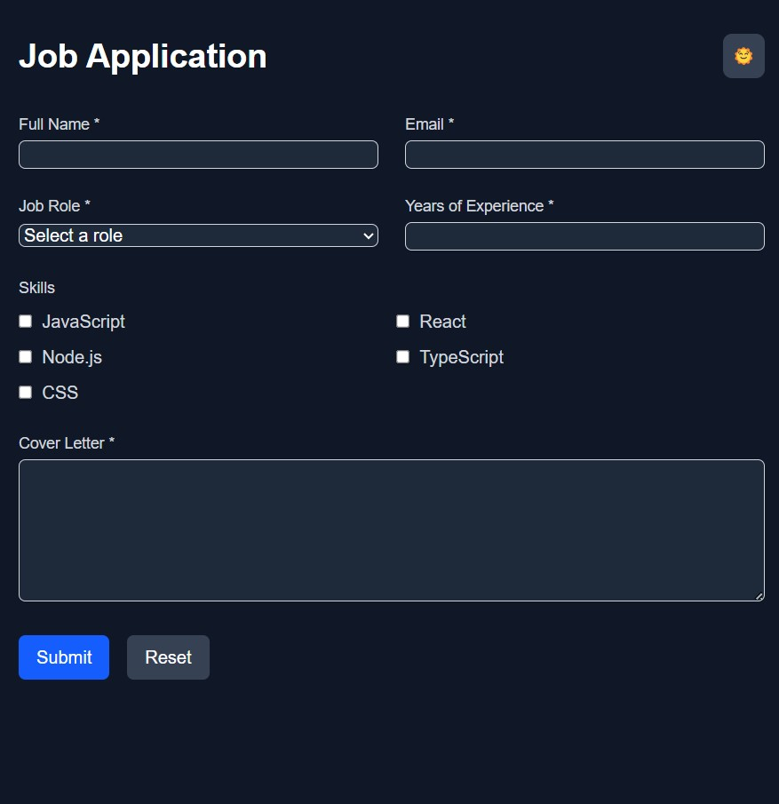

# Job Application Form 🚀

[](https://nextjs.org/)
[](https://docs.pmnd.rs/zustand)
[](https://tailwindcss.com/)
[](https://your-vercel-deployment-link.vercel.app/)

A modern job application form with robust state management and elegant UI, built using Next.js and enhanced with Tailwind CSS.



## Features ✨

### 🧩 Component-Based Architecture

- Organized directory structure for maintainability
- Type-safe React components with TypeScript

### 📦 State Management

- Zustand store for form state persistence
- LocalStorage integration for data preservation
- Real-time form data synchronization
- Submission status tracking (`isSubmitting`, `submitted`)

### 🛡️ Validation & Error Handling

- form validation
- Validation for:
  - Required fields
  - Email format verification
  - Minimum experience validation

### 📄 Submission Handling

- Beautifully formatted submission preview
- JSON data display with proper formatting

### ⏳ Loading States

- Disabled inputs and buttons during submission
- Prevent duplicate submissions

### 🌗 Dark/Light Mode

## Live Demo 🌍

[View Live Demo](https://fanap-interview.vercel.app/)

## Installation 🛠️

1. Clone the repository

```bash
git clone https://github.com/i-mml/fanap-interview.git
npm install
npm run dev
```
